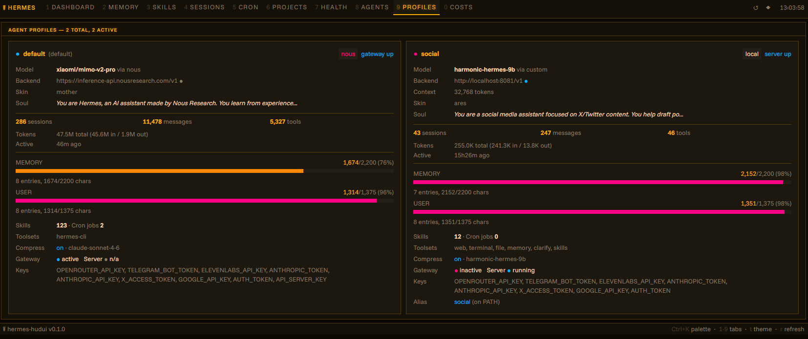
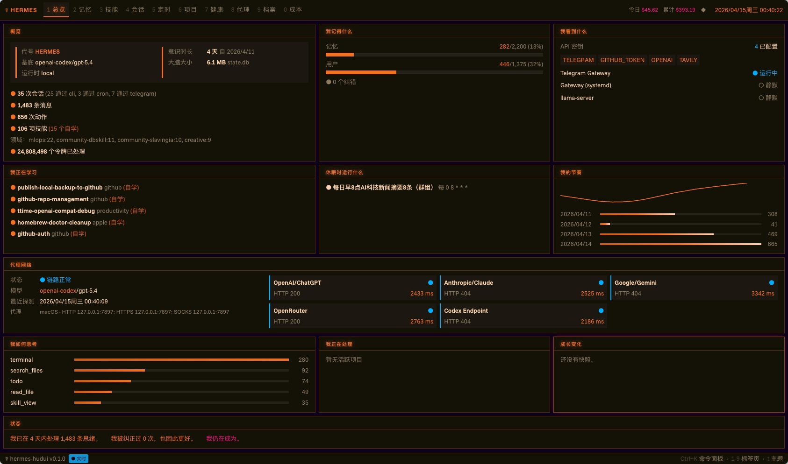

# ☤ Hermes HUD — Web UI

一个更适合日常常驻打开的 Hermes 浏览器仪表盘：把 agent 的记忆、技能、会话、项目、健康状态、token 成本与代理网络状态，集中放进一个深色科技风界面里。

它延续了 [TUI 版本](https://github.com/joeynyc/hermes-hud) 的同一套数据源与核心监控视角，但在浏览器里提供了更直观的总览、更强的可视化，以及更适合长期盯盘的使用体验。

> 这不是一个普通后台页面，而是一块给 Hermes 准备的“驾驶舱”：打开之后，你能一眼知道它现在在做什么、记住了什么、花了多少钱、网络链路是否正常。

## 一眼看懂

- 深色高对比仪表盘风格，适合长期常驻
- 新增爱马仕橙主题，信息重点更醒目
- 新增模型代理网络状态栏，可直接查看链路、状态码与延迟
- 适合用来展示 Hermes 的“实时状态 + 成本 + 能力面板”






## 新增内容

- 新增爱马仕橙主题，整体界面更适合深色终端风与高对比展示
- 新增模型代理网络状态栏，可直接查看代理链路、各模型服务 HTTP 状态码与延迟

## 这个面板能看到什么

你可以直接看到 agent 对“自己”的整体认知：

- **身份信息**：名称、运行基座、运行时、已运行天数、上下文规模
- **我知道什么**：会话数量、消息数量、执行过的动作、已掌握技能
- **我记得什么**：记忆容量条、用户画像状态、已吸收的纠错
- **我看见什么**：API Key 是否存在、各服务当前是否健康
- **我最近在学什么**：最近改动过的技能及其分类
- **我正在做什么**：活跃项目及工作区是否有未提交改动
- **我睡着时还在跑什么**：定时 cron 任务
- **我是怎么思考的**：工具使用模式与占比趋势
- **我的节奏如何**：每日活跃度火花线
- **最近成长了什么**：快照差异，显示最近有哪些变化
- **花了多少钱**：按模型统计的美元 token 成本与每日趋势
- **模型代理网络状态**：查看本地代理链路、模型网关可用性、HTTP 状态码与延迟

## 实时更新

当 agent 数据发生变化时，HUD 会自动刷新，不需要手动重载页面。

- **WebSocket 实时连接**：数据一变化就广播到前端
- **智能缓存**：后端会缓存较重的数据读取，并在文件变化时自动失效
- **静默刷新**：后台更新数据，不会频繁闪烁或打断阅读
- **在线状态指示**：状态栏中的 `● live` 会显示实时连接是否正常

## 快速开始

```bash
git clone https://github.com/joeynyc/hermes-hudui.git
cd hermes-hudui
python3.11 -m venv venv
source venv/bin/activate
./install.sh
hermes-hudui
```

然后打开：

http://localhost:3001

以后再次启动时，只需要：

```bash
source venv/bin/activate
hermes-hudui
```

## 运行要求

- Python 3.11+
- Node.js 18+（用于构建前端）
- 本机已经有一个正在使用中的 Hermes，并且 `~/.hermes/` 下已有数据

不需要额外数据库或额外服务，这个 Web UI 会直接读取 agent 的数据目录。

## 手动安装

```bash
# 1. 创建并激活虚拟环境
python3.11 -m venv venv
source venv/bin/activate

# 2. 安装当前项目
pip install -e .

# 3. 构建前端
cd frontend
npm install
npm run build
cp -r dist/* ../backend/static/

# 4. 启动服务
hermes-hudui
```

## 主题

内置 4 套颜色主题，可通过 `t` 键或主题选择器切换：

| 主题 | 键值 | 风格 |
|------|------|------|
| **Neural Awakening** | `ai` | 深海军蓝底 + 青蓝色高亮，偏冷静、理性的 AI 观感 |
| **Blade Runner** | `blade-runner` | 暖黑底 + 琥珀橙色高亮，赛博黑色电影氛围 |
| **Hermès Orange** | `hermes-orange` | 黑底 + 爱马仕橙高亮，信息层级更醒目，更适合长时间监控查看 |
| **fsociety** | `fsociety` | 纯黑底 + 绿色高亮，强烈黑客风 |
| **Anime** | `anime` | 靛蓝底 + 紫罗兰高亮，带一点超能力感 |

还支持可选 CRT 扫描线效果，也可以在主题选择器里开关。

## 键盘快捷键

| 按键 | 作用 |
|------|------|
| `1`-`9`, `0` | 切换不同标签页 |
| `t` | 打开/关闭主题选择器 |
| `Ctrl+K` | 打开命令面板 |

## 架构

```text
React Frontend (Vite + SWR)
    ↓ /api/*（开发环境下代理）+ WebSocket /ws
FastAPI Backend (Python)
    ↓ collectors/*.py + cache + file watcher
~/.hermes/（agent 数据目录）
```

**后端：**
- **Collectors**：从 `~/.hermes/` 读取数据并整理成 dataclass
- **Caching**：基于 mtime 的智能缓存失效机制（sessions 30s、skills 60s、patterns 60s、profiles 45s TTL）
- **File Watcher**：通过 `watchfiles` 监听 `~/.hermes/` 变化
- **WebSocket**：向所有已连接客户端广播 `data_changed` 事件

**前端：**
- **SWR**：从 `/api/*` 拉取数据，并通过 `keepPreviousData` 保持静默更新
- **WebSocket Hook**：自动重连、指数退避；收到变更事件后触发 SWR 重新校验
- **Panels**：每个标签页一个组件，刷新期间保留旧数据，避免明显 loading 闪烁

## Token 成本计价

成本会根据 token 数量和内置单价表直接换算。当前支持的模型如下：

| 提供商 | 模型 | 输入 | 输出 | 缓存读取 |
|--------|------|-----:|-----:|--------:|
| Anthropic | Claude Opus 4 | $15/M | $75/M | $1.50/M |
| Anthropic | Claude Sonnet 4 | $3/M | $15/M | $0.30/M |
| Anthropic | Claude Haiku 3.5 | $0.80/M | $4/M | $0.08/M |
| OpenAI | GPT-4o | $2.50/M | $10/M | $1.25/M |
| OpenAI | o1 | $15/M | $60/M | $7.50/M |
| DeepSeek | V3 | $0.27/M | $1.10/M | $0.07/M |
| xAI | Grok 3 | $3/M | $15/M | $0.75/M |
| Google | Gemini 2.5 Pro | $1.25/M | $10/M | $0.31/M |

如果模型不在上表中，会回退为 Claude Opus 的价格规则；本地/免费模型会自动按 $0 处理。

## 与 TUI 的关系

这个项目可以理解为 [hermes-hud](https://github.com/joeynyc/hermes-hud) 的浏览器版搭档。两者都会独立读取同一个 `~/.hermes/` 数据目录，所以你可以只用其中一个，也可以两个同时开着。

Web UI 是完全独立的，不依赖 TUI 包本体。它还补充了一些 TUI 没有的能力，比如：

- 独立的 Memory、Skills、Sessions 标签页
- 按模型统计 token 成本
- 命令面板
- 支持实时预览的主题切换器

如果你也想同时安装 TUI，可以使用：

```bash
pip install hermes-hudui[tui]
```

## 平台支持

- **macOS**：原生支持，直接运行 `./install.sh`
- **Linux**：原生支持，直接运行 `./install.sh`
- **Windows**：建议通过 WSL（Windows Subsystem for Linux）运行
- **WSL**：安装脚本会自动识别

## License

MIT，详见 [LICENSE](LICENSE)。

## Star History

<a href="https://www.star-history.com/?repos=joeynyc%2Fhermes-hudui&type=date&logscale=&legend=top-left">
 <picture>
   <source media="(prefers-color-scheme: dark)" srcset="https://api.star-history.com/chart?repos=joeynyc/hermes-hudui&type=date&theme=dark&legend=top-left" />
   <source media="(prefers-color-scheme: light)" srcset="https://api.star-history.com/chart?repos=joeynyc/hermes-hudui&type=date&legend=top-left" />
   
 </picture>
</a>
